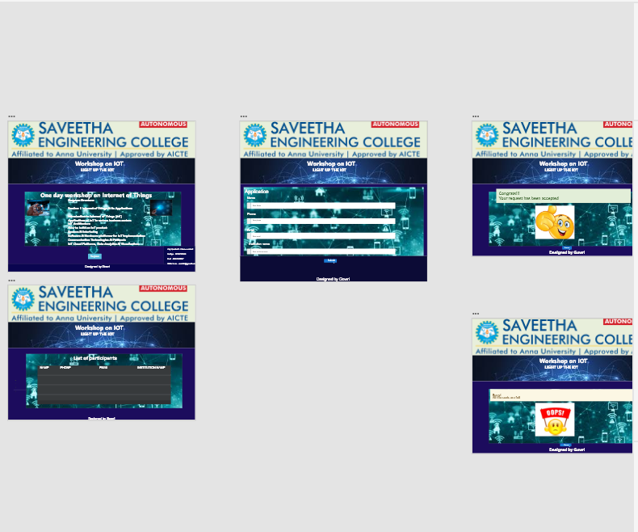

# WebApplication for Event Registration

## AIM:
To create a UX design and develop a web application for event registration.
## DESIGN STEPS:
### Step 1: 
Requirement collection.
### Step 2:
Choosing the suitable color scheme
### Step 3:
Creating artboards for individual pages
### Step 4:
Designing layout for individual pages
### Step 5:
Creating links and linking it with artboards
### Step 6:
Preview the prototype.
### Step 7:
Creating the layout using HTML and CSS.
### Step 8:
Updating the sample content.
### Step 9:
Choose the appropriate style and color scheme.
### Step 10:
Validate the layout in various browsers.
### Step 11:
Validate the HTML code.
### Step 12:
Create a database model and migrate the database.
### Step 13:
Retrieve data from database and display it in a dynamic webpage.
### Step 14:
Publish the website in the given URL.


## DESIGN SCREENS:


## WIREFRAME:


## PROTOTYPE:


## PROGRAM:

### home.html
```
<!doctype html>
<html lang="en">
  <head>
    <!-- Required meta tags -->
    <meta charset="utf-8">
    <meta name="viewport" content="width=device-width, initial-scale=1, shrink-to-fit=no">

    <!-- Bootstrap CSS -->
    <link rel="stylesheet" href="https://maxcdn.bootstrapcdn.com/bootstrap/4.0.0/css/bootstrap.min.css" integrity="sha384-Gn5384xqQ1aoWXA+058RXPxPg6fy4IWvTNh0E263XmFcJlSAwiGgFAW/dAiS6JXm" crossorigin="anonymous">

    <title>Event Management</title>
  </head>
  <body style="background-color: rgb(4, 19, 53);" class="text-center">
    <div class="jumbotron jumbotron-fluid text-center" style="background-color: rgb(4, 19, 53);">
        
<div class="card bg-dark text-white">
  
  <div class="card-img-overlay">
    <h5 class=" card-text display-4 font-weight-bold">Worshop on IOT</h5>
    <p class="card-text font-weight-bold">LIGHT UP THE IOT</p>
    </div>
</div>
</div>
        </div>
    <div class="container" style="background-color: rgb(8, 8, 56);">
        <div class="row">
            <div class="card bg-dark text-white col-lg-12">
  
  <div class="card-img-overlay text-center">
    <h5 class=" card-text display-4 font-weight-bold">One day workshop on Internet of Things</h5>
    

<p class="card-text"><p><strong>Program Structure:</strong></p>

<p><strong>Session:&nbsp;1 Internet of Things &amp; Its Applications</strong></p>

<ul>
	<li>Introduction to Internet of Things (IoT)</li>
	<li>Applications of IoT in various business sectors</li>
	<li>IoT Architecture</li>
	<li>How to build an IoT product</li>
	<li>Sensors &amp; Interfacing</li>
	<li>Software &amp; Hardware platforms for IoT implementation</li>
	<li>Communication Technologies &amp; Protocols</li>
	<li>IoT Cloud Platforms, Data Analytics &amp; Visulazation</li>
	<li>Industrial Internet of Things</li>
</ul>

<p><strong>Session 2. Demonstration of various prototypes and usecases.</strong></p>

<ul>
	<li>Smart Transportation System</li>
	<li>Intelligent Drip Irrigation System</li>
	<li>Intelligent Water Leakage System</li>
	<li>Intelligent Water Management System</li>
	<li>Smart Poultry Management System</li>
	<li>Smart Kitchen&nbsp;</li>
</ul>
            
		</div>
    </div>
</div>
        </div>
    </div>
    </div>
    <div class="text-center">
  
</div>
<div class="text-center">
    <a class="btn btn-info btn-lg text center" href="/register/" role="button">Register</a>
  </div>
  <div class="card bg-dark text-white col-lg-12">
  
  <div class="card-img-overlay text-right">
      <p><strong>Any Queries?: Please contact</strong></p>
        <p>Sathya : 9876787656</p>
        <p>Kavi : 9657456987</p>
        <p>Write to us : eventiot@gmail.com</p>
    </div>
    </div>
        <div class="card bg-dark text-white col-lg-12">
  
  <div class="card-img-overlay text-center" >
      <p><strong>Designed by Gowri</strong></p>
    </div>
         </div>
    

    <!-- Optional JavaScript -->
    <!-- jQuery first, then Popper.js, then Bootstrap JS -->
    <script src="https://code.jquery.com/jquery-3.2.1.slim.min.js" integrity="sha384-KJ3o2DKtIkvYIK3UENzmM7KCkRr/rE9/Qpg6aAZGJwFDMVNA/GpGFF93hXpG5KkN" crossorigin="anonymous"></script>
    <script src="https://cdnjs.cloudflare.com/ajax/libs/popper.js/1.12.9/umd/popper.min.js" integrity="sha384-ApNbgh9B+Y1QKtv3Rn7W3mgPxhU9K/ScQsAP7hUibX39j7fakFPskvXusvfa0b4Q" crossorigin="anonymous"></script>
    <script src="https://maxcdn.bootstrapcdn.com/bootstrap/4.0.0/js/bootstrap.min.js" integrity="sha384-JZR6Spejh4U02d8jOt6vLEHfe/JQGiRRSQQxSfFWpi1MquVdAyjUar5+76PVCmYl" crossorigin="anonymous"></script>
  </body>
</html>
```
### register.html
```
<!doctype html>
<html lang="en">

<head>
    <!-- Required meta tags -->
    <meta charset="utf-8">
    <meta name="viewport" content="width=device-width, initial-scale=1, shrink-to-fit=no">

    <!-- Bootstrap CSS -->
    <link rel="stylesheet" href="https://maxcdn.bootstrapcdn.com/bootstrap/4.0.0/css/bootstrap.min.css"
        integrity="sha384-Gn5384xqQ1aoWXA+058RXPxPg6fy4IWvTNh0E263XmFcJlSAwiGgFAW/dAiS6JXm" crossorigin="anonymous">

    <title>Event Management</title>
</head>

<body style="background-color: rgb(4, 19, 53);">
    <div class="jumbotron jumbotron-fluid text-center" style="background-color: rgb(4, 19, 53);">
        
<div class="card bg-dark text-white">
  
  <div class="card-img-overlay">
    <h5 class=" card-text display-4 font-weight-bold">Worshop on IOT</h5>
    <p class="card-text font-weight-bold">LIGHT UP THE IOT</p>
    </div>
</div>
</div>
        </div>
    <div class="container" style="background-color: rgb(8, 8, 56);">
        <div class="row">
            <div class="card bg-dark text-white col-lg-12">
  
  <div class="card-img-overlay">
                <h1>Application</h1>
        <form action="/register/" method="POST">
            
            <div class="form-group">
                <label for="name">Name</label>
                <input type="name" class="form-control" name="username" id="username" aria-describedby="emailHelp"
                    placeholder="Enter name">
            </div>
            <div class="form-group">
                <label for="phone">Phone</label>
                <input type="phone" class="form-control" name="phone" id="phone" placeholder="Enter phone number">
            </div>
            <div class="form-group">
                <label for="exampleInputEmail1">Email address</label>
                <input type="email" class="form-control" name="email" id="email" aria-describedby="emailHelp"
                    placeholder="Enter email">
                <small id="emailHelp" class="form-text text-muted">We'll never share your email with anyone
                    else.</small>
            </div>
            <div class="form-group">
                <label for="institutionname">Institution name</label>
                <input type="institutionname" class="form-control" name="institution" id="institution"
                    placeholder="Enter institution name">
            </div>
            <div class="text-center">
                <button type="submit" class="btn btn-primary">Submit</button>
            </div>
        </form>
        </div>
        </div>
    </div>
    </div>

    </div>
    <div class="card bg-dark text-white col-lg-12">
  
  <div class="card-img-overlay text-center" >
      <p><strong>Designed by Gowri</strong></p>
    </div>
         </div>


    <!-- Optional JavaScript -->
    <!-- jQuery first, then Popper.js, then Bootstrap JS -->
    <script src="https://code.jquery.com/jquery-3.2.1.slim.min.js"
        integrity="sha384-KJ3o2DKtIkvYIK3UENzmM7KCkRr/rE9/Qpg6aAZGJwFDMVNA/GpGFF93hXpG5KkN"
        crossorigin="anonymous"></script>
    <script src="https://cdnjs.cloudflare.com/ajax/libs/popper.js/1.12.9/umd/popper.min.js"
        integrity="sha384-ApNbgh9B+Y1QKtv3Rn7W3mgPxhU9K/ScQsAP7hUibX39j7fakFPskvXusvfa0b4Q"
        crossorigin="anonymous"></script>
    <script src="https://maxcdn.bootstrapcdn.com/bootstrap/4.0.0/js/bootstrap.min.js"
        integrity="sha384-JZR6Spejh4U02d8jOt6vLEHfe/JQGiRRSQQxSfFWpi1MquVdAyjUar5+76PVCmYl"
        crossorigin="anonymous"></script>
</body>

</html>
```
### success.html
```
<!doctype html>
<html lang="en">
  <head>
    <!-- Required meta tags -->
    <meta charset="utf-8">
    <meta name="viewport" content="width=device-width, initial-scale=1, shrink-to-fit=no">

    <!-- Bootstrap CSS -->
    <link rel="stylesheet" href="https://maxcdn.bootstrapcdn.com/bootstrap/4.0.0/css/bootstrap.min.css" integrity="sha384-Gn5384xqQ1aoWXA+058RXPxPg6fy4IWvTNh0E263XmFcJlSAwiGgFAW/dAiS6JXm" crossorigin="anonymous">

    <title>Event Management</title>
  </head>
  <body  style="background-color: rgb(4, 19, 53);">
    <div class="jumbotron jumbotron-fluid text-center" style="background-color: rgb(4, 19, 53);">
        
<div class="card bg-dark text-white">
  
  <div class="card-img-overlay">
    <h5 class=" card-text display-4 font-weight-bold">Worshop on IOT</h5>
    <p class="card-text font-weight-bold">LIGHT UP THE IOT</p>
    </div>
</div>
</div>
    <div class="container" style="background-color: rgb(8, 8, 56);">
        <div class="row">
            <div class="card bg-dark text-white col-lg-12">
  
  <div class="card-img-overlay text-center">
        <div class="alert alert-success" role="alert">
  <h4 class="alert-heading">Congrats!</h4>
  <p>Your request has been accepted!!!</p> 
</div>
 
</div>
        </div>
    </div>
    </div>
            <div class="col-12 text-center">
               <a class="btn btn-info btn-lg" href="/home/" role="button">Home</a>
            </div>
            <div class="card bg-dark text-white col-lg-12">
  
  <div class="card-img-overlay text-center" >
      <p><strong>Designed by Gowri</strong></p>
    </div>
         </div>
    </div>
    <!-- Optional JavaScript -->
    <!-- jQuery first, then Popper.js, then Bootstrap JS -->
    <script src="https://code.jquery.com/jquery-3.2.1.slim.min.js" integrity="sha384-KJ3o2DKtIkvYIK3UENzmM7KCkRr/rE9/Qpg6aAZGJwFDMVNA/GpGFF93hXpG5KkN" crossorigin="anonymous"></script>
    <script src="https://cdnjs.cloudflare.com/ajax/libs/popper.js/1.12.9/umd/popper.min.js" integrity="sha384-ApNbgh9B+Y1QKtv3Rn7W3mgPxhU9K/ScQsAP7hUibX39j7fakFPskvXusvfa0b4Q" crossorigin="anonymous"></script>
    <script src="https://maxcdn.bootstrapcdn.com/bootstrap/4.0.0/js/bootstrap.min.js" integrity="sha384-JZR6Spejh4U02d8jOt6vLEHfe/JQGiRRSQQxSfFWpi1MquVdAyjUar5+76PVCmYl" crossorigin="anonymous"></script>
  </body>
</html>
```
### failed.html
```
<!doctype html>
<html lang="en">
  <head>
    <!-- Required meta tags -->
    <meta charset="utf-8">
    <meta name="viewport" content="width=device-width, initial-scale=1, shrink-to-fit=no">

    <!-- Bootstrap CSS -->
    <link rel="stylesheet" href="https://maxcdn.bootstrapcdn.com/bootstrap/4.0.0/css/bootstrap.min.css" integrity="sha384-Gn5384xqQ1aoWXA+058RXPxPg6fy4IWvTNh0E263XmFcJlSAwiGgFAW/dAiS6JXm" crossorigin="anonymous">

    <title>Event Management</title>
  </head>
  <body  style="background-color: rgb(4, 19, 53);">
    <div class="jumbotron jumbotron-fluid text-center" style="background-color: rgb(4, 19, 53);">
        
<div class="card bg-dark text-white">
  
  <div class="card-img-overlay">
    <h5 class=" card-text display-4 font-weight-bold">Worshop on IOT</h5>
    <p class="card-text font-weight-bold">LIGHT UP THE IOT</p>
    </div>
</div>
</div>
        </div>
    <div class="container" style="background-color: rgb(8, 8, 56);">
        <div class="row">
            <div class="card bg-dark text-white col-lg-12">
  
  <div class="card-img-overlay text-center">
        <div class="alert alert-danger" role="alert">
  <h4 class="alert-heading">Sorry</h4>
  <p>All the seats are full...</p> 
</div>
 
</div>
        </div>
    </div>
    </div>
            <div class="col-12 text-center">
               <a class="btn btn-info btn-lg" href="/home/" role="button">Home</a>
            </div>
            <div class="card bg-dark text-white col-lg-12">
  
  <div class="card-img-overlay text-center" >
      <p><strong>Designed by Gowri</strong></p>
    </div>
         </div>
        </div>

    <!-- Optional JavaScript -->
    <!-- jQuery first, then Popper.js, then Bootstrap JS -->
    <script src="https://code.jquery.com/jquery-3.2.1.slim.min.js" integrity="sha384-KJ3o2DKtIkvYIK3UENzmM7KCkRr/rE9/Qpg6aAZGJwFDMVNA/GpGFF93hXpG5KkN" crossorigin="anonymous"></script>
    <script src="https://cdnjs.cloudflare.com/ajax/libs/popper.js/1.12.9/umd/popper.min.js" integrity="sha384-ApNbgh9B+Y1QKtv3Rn7W3mgPxhU9K/ScQsAP7hUibX39j7fakFPskvXusvfa0b4Q" crossorigin="anonymous"></script>
    <script src="https://maxcdn.bootstrapcdn.com/bootstrap/4.0.0/js/bootstrap.min.js" integrity="sha384-JZR6Spejh4U02d8jOt6vLEHfe/JQGiRRSQQxSfFWpi1MquVdAyjUar5+76PVCmYl" crossorigin="anonymous"></script>
  </body>
</html>
```
### participants.html
```
<!doctype html>
<html lang="en">
  <head>
    <!-- Required meta tags -->
    <meta charset="utf-8">
    <meta name="viewport" content="width=device-width, initial-scale=1, shrink-to-fit=no">

    <!-- Bootstrap CSS -->
    <link rel="stylesheet" href="https://maxcdn.bootstrapcdn.com/bootstrap/4.0.0/css/bootstrap.min.css" integrity="sha384-Gn5384xqQ1aoWXA+058RXPxPg6fy4IWvTNh0E263XmFcJlSAwiGgFAW/dAiS6JXm" crossorigin="anonymous">

    <title>Event Management</title>
  </head>
  <body style="background-color: rgb(4, 19, 53);">
     <div class="jumbotron jumbotron-fluid text-center" style="background-color: rgb(4, 19, 53);">
        
<div class="card bg-dark text-white">
  
  <div class="card-img-overlay">
    <h5 class=" card-text display-4 font-weight-bold">Worshop on IOT</h5>
    <p class="card-text font-weight-bold">LIGHT UP THE IOT</p>
    </div>
</div>
</div>
  <div class="container" style="background-color: rgb(8, 8, 56);">
        <div class="row">
            <div class="card bg-dark text-white col-lg-12">
  
  <div class="card-img-overlay text-center">
    <h1>List of Participants</h1>
        <div class="row">
            <div class="col-12">
                <table class="table">
                    <thead>
                        <tr>
                            <th scope="col">NAME</th>
                            <th scope="col">PHONE</th>
                            <th scope="col">EMAIL</th>
                            <th scope="col">INSTITUTION</th>
                        </tr>
                    </thead>
                    <tbody>
                        
                        <tr>
                            <td>{{ p.username }}</td>
                            <td>{{ p.phone }}</td>
                            <td>{{ p.email }}</td>
                            <td>{{ p.institution }}</td>
                        </tr>
                        
                    </tbody>

                </table>

            </div>

        </div>
    </div>
        </div>
    </div>
    </div>
    <div class="col-12 text-center">
               <a class="btn btn-info btn-lg" href="/home/" role="button">Home</a>
            </div>
            <div class="card bg-dark text-white col-lg-12">
  
  <div class="card-img-overlay text-center" >
      <p><strong>Designed by Gowri</strong></p>
    </div>
         </div>

    <!-- Optional JavaScript -->
    <!-- jQuery first, then Popper.js, then Bootstrap JS -->
    <script src="https://code.jquery.com/jquery-3.2.1.slim.min.js" integrity="sha384-KJ3o2DKtIkvYIK3UENzmM7KCkRr/rE9/Qpg6aAZGJwFDMVNA/GpGFF93hXpG5KkN" crossorigin="anonymous"></script>
    <script src="https://cdnjs.cloudflare.com/ajax/libs/popper.js/1.12.9/umd/popper.min.js" integrity="sha384-ApNbgh9B+Y1QKtv3Rn7W3mgPxhU9K/ScQsAP7hUibX39j7fakFPskvXusvfa0b4Q" crossorigin="anonymous"></script>
    <script src="https://maxcdn.bootstrapcdn.com/bootstrap/4.0.0/js/bootstrap.min.js" integrity="sha384-JZR6Spejh4U02d8jOt6vLEHfe/JQGiRRSQQxSfFWpi1MquVdAyjUar5+76PVCmYl" crossorigin="anonymous"></script>
  </body>
</html>
```
### views.py
```
from django.shortcuts import render

from .models import Participant

# Create your views here.
def home(request):
    context = {}
    return render(request, 'event/home.html', context)

def register(request):
    context = {}
    if request.method == 'POST':
        p1 = Participant()
        p1.username = request.POST.get('username','_')
        p1.phone = request.POST.get('phone','000')
        p1.email = request.POST.get('email','_')
        p1.institution = request.POST.get('institution','_')

        if len(Participant.objects.all()) > 10:
            return render(request, 'event/failed.html', context)
        else:
            p1.save()
            return render(request, 'event/success.html', context)
    
    if request.method =='GET':
        context['username'] = ''
        context['phone'] = ''
        context['email'] = ''
        context['institution'] = ''
    return render(request, 'event/register.html', context)

def participants(request):
    context = {}

    context["participants"] = Participant.objects.all();
    return render(request, 'event/participants.html', context)

def failed(request):
    context = {}
    return render(request, 'event/failed.html', context)

def success(request):
    context = {}
    return render(request, 'event/success.html', context)
```
## OUTPUT:


## CODE VALIDATION REPORT:


## RESULT:
   Thus a UX design and develop a web application for event registration is created and is hosted in the URL http://gowri.student.saveetha.in:8000/home, http://gowri.student.saveetha.in:8000/participants. HTML code is validated.
